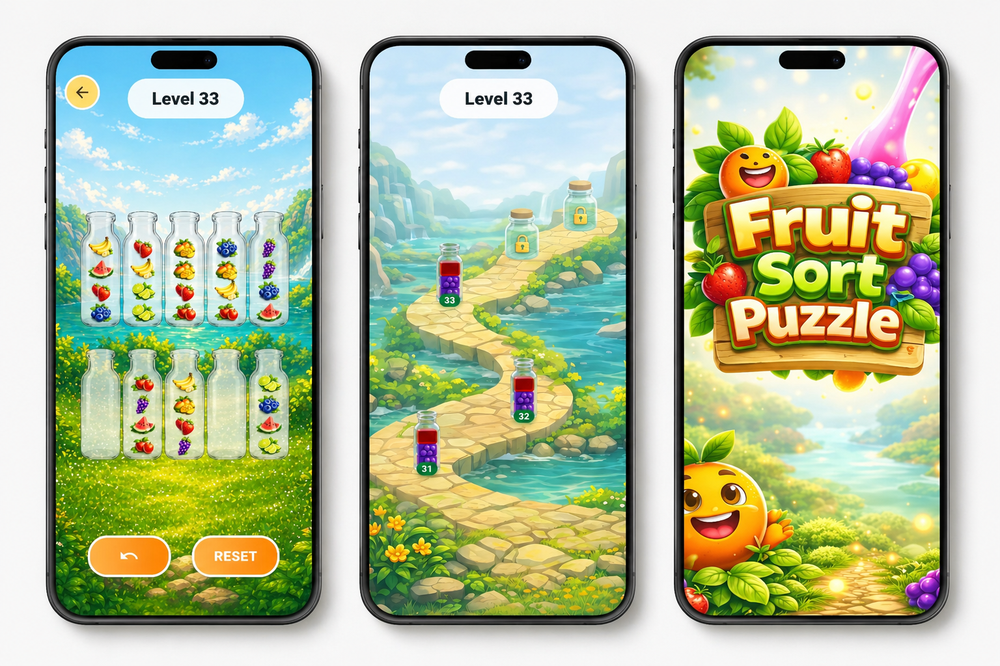

# 🧩 Layered

**Live Demo:** [layered-7d3cb.web.app](https://layered-7d3cb.web.app/)

A cross-platform puzzle game built with **Flutter**, showcasing a robust **Clean Layered Architecture** and structured state management using **BLoC/Cubit**.

Layered challenges players to sort stacked slabs into bottles following strict stacking rules across **100 progressively difficult levels** — all playable fully offline.

> The name **Layered** reflects both the stacking-based gameplay mechanics and the layered architectural pattern used in the codebase.

---

## 📱 UI Preview

<div align="center">
  
  <p><i>Immersive puzzle gameplay with a clean, modern aesthetic.</i></p>
</div>

---

## 🚀 Features

### 🎮 Core Gameplay
- **100 Levels**: Progressively challenging hand-crafted levels.
- **Water-Sort Mechanics**: Intuitive stacking and sorting logic.
- **Move Validation**: Strict rules-based validation engine.
- **Undo/Reset**: Full state tracking for mistake recovery.
- **Win Detection**: Automatic evaluation of game state.

### 🗺 Progression System
- **Interactive Map**: Roadmap-based level selection.
- **Sequential Unlocking**: Progressive journey through levels.
- **Persistence**: Resume exactly where you left off.

### 💾 Offline-First Design
- **Local Storage**: Powered by Hive for fast, reliable data persistence.
- **Zero Internet Required**: Play anywhere, anytime.
- **Settings Management**: Persistent user preferences.

### 🎨 User Experience
- **Fluid Animations**: Smooth transitions and splash screen effects.
- **Onboarding**: Seamless first-time player introduction.
- **Responsive Design**: Optimized for Android, iOS, Web, and Desktop.
- **Custom Assets**: Hand-picked Slab and Bottle visuals.

---

## 🏗 Architecture

Layered follows a **Feature-based Layered Architecture**, ensuring strict separation of concerns and high maintainability.

### Feature Structure
Each feature is partitioned into specialized layers:

- **Presentation Layer**: UI Components, Pages, and **Cubit** for reactive state management.
- **Domain Layer**: Core business logic, entities, and game rules.
- **Data Layer**: Handled globally via services for local persistence.

```
features/
 └── feature_name/
      ├── domain/         # Business Logic & Models
      └── presentation/   # UI, Cubits, & Widgets
```

This structure enables:
- **Scalability**: Add new features without side effects.
- **Testability**: Independent logic validation.
- **Clarity**: Predictable code location.

---

## 📂 Project Structure

```
lib/
├── core/
│   ├── constants/    # App-wide colors and strings
│   ├── responsive/   # Layout scaling logic
│   ├── router/       # GoRouter configuration
│   ├── services/     # Global services (Hive, etc.)
│   └── themes/       # Material design themes
│
└── features/
    ├── initial/      # Splash & Onboarding
    ├── game_map/     # Level selection & Roadmap
    └── game_play/    # Core puzzle engine
```

---

## 🧠 Tech Stack

| Component | Technology |
|---|---|
| **Framework** | Flutter |
| **Language** | Dart |
| **State Management** | BLoC / Cubit |
| **Local Storage** | Hive |
| **Navigation** | GoRouter |
| **Styling** | Google Fonts, Material 3 |
| **Deployment** | Firebase Hosting (Web) |

---

## 🎯 Engineering Highlights

- **Deterministic Engine**: Solid move validation logic based on stack theory.
- **State Restoration**: Robust undo/redo functionality using immutable state.
- **Reactive UI**: Efficient rebuilds using BlocBuilder and Cubits.
- **Modular Design**: Decoupled features for easier team collaboration.

---

## 🧪 Testing

The architecture is designed for testability. The **Domain Layer** contains pure Dart logic, making it easy to unit test:
- Move legality validation.
- Level completion conditions.
- Undo stack integrity.

---

## 🚀 Getting Started

1. **Clone the repository:**
   ```bash
   git clone https://github.com/maitry4/Layered.git
   ```
2. **Install dependencies:**
   ```bash
   flutter pub get
   ```
3. **Run the application:**
   ```bash
   flutter run
   ```
